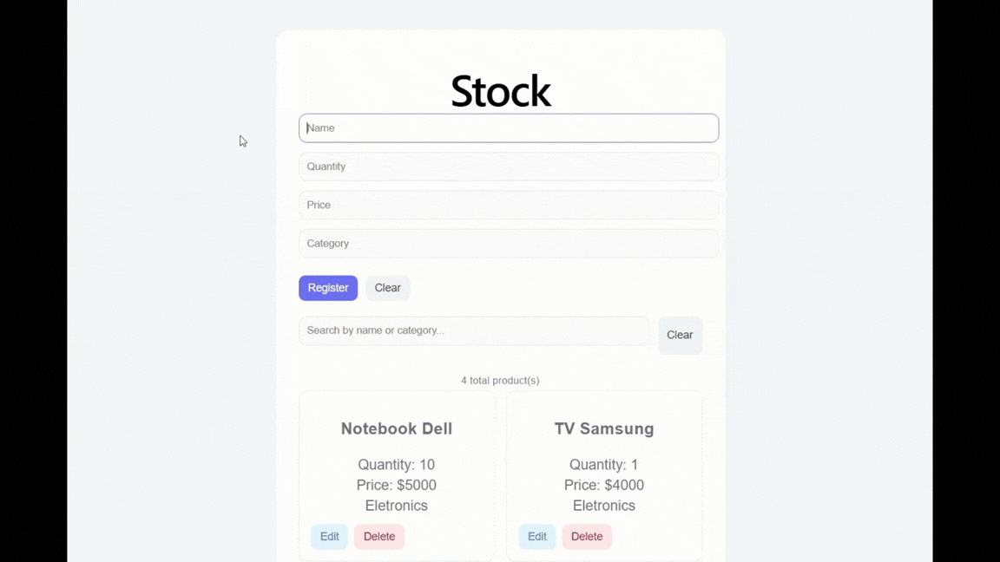
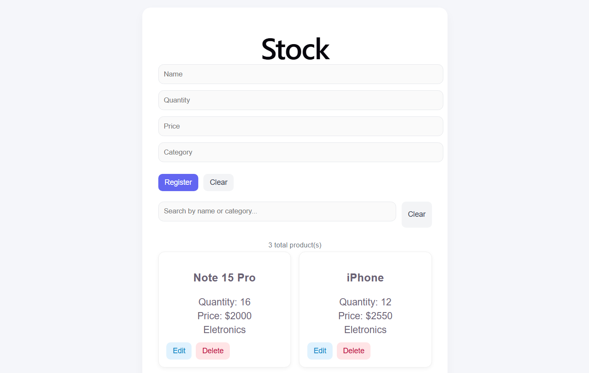
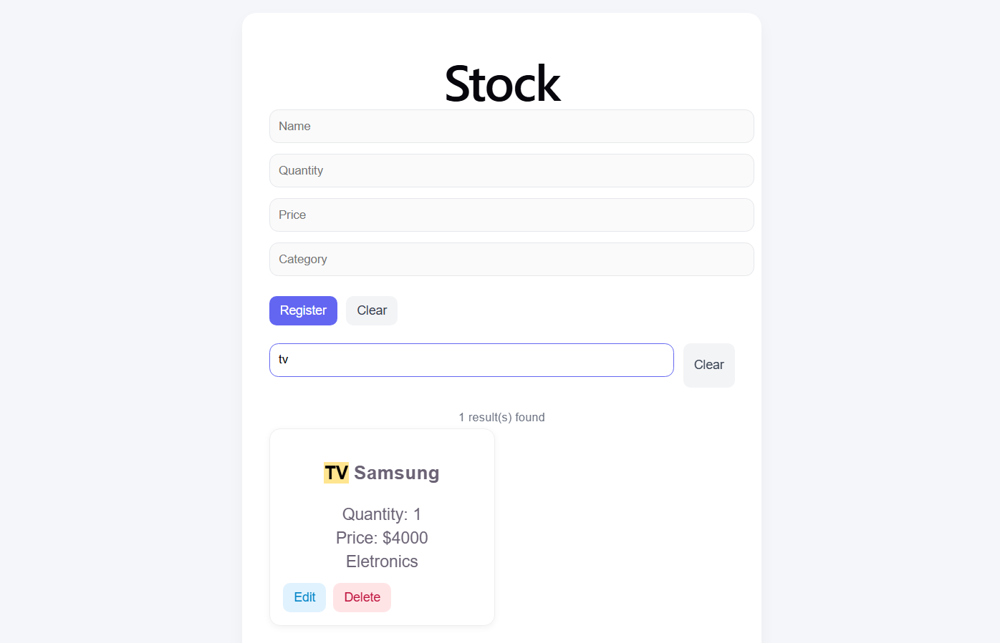
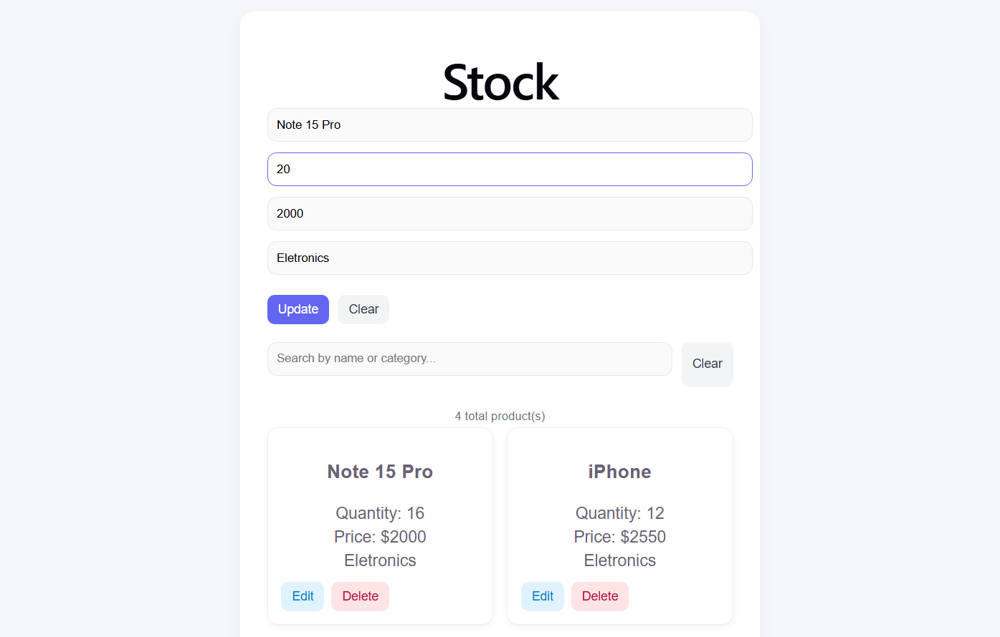
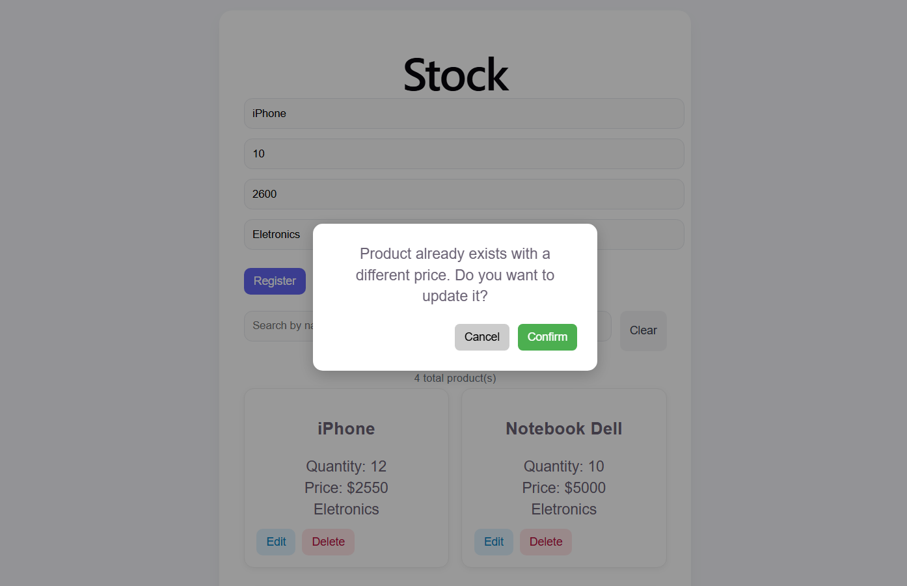

# 📦 Stock Control - Frontend

Aplicação web para gerenciamento de estoque, integrada à API REST desenvolvida com Spring Boot.

> Frontend for stock management, built with React, featuring validation, user feedback and responsive design.

---

## 📄 Summary

React • CRUD • REST API • Form Validation • Toast Feedback • Pagination • Responsive Design • UX/UI

---

## 🚀 Funcionalidades

- Cadastro de produtos
- Edição de produtos
- Exclusão de produtos
- Busca por nome e categoria (com debounce)
- Validação de formulário em tempo real
- Feedback visual com Toasts
- Confirmação ao detectar produto duplicado
- Paginação de resultados
- Layout responsivo

---

## 🛠️ Tecnologias

- React
- JavaScript (ES6+)
- CSS3
- Fetch API

---

## 🧠 Estrutura

O projeto é organizado em componentes reutilizáveis:

- Components → UI (ProductCard, ProductForm, Toast, Modal)
- Services → comunicação com API
- Pages → estrutura principal da aplicação

---

## 📷 Preview

### 🔹 Interface

### 🔹 Interface da aplicação

### 🔹 Pesquisar

### 🔹 Edição de itens

### 🔹 Confirmação em caso de nome e categoria iguais

---

## ▶️ Como executar o projeto

### 1. Clonar o repositório

git clone https://github.com/deborajaldir/stock-control-frontend.git

### 2. Instalar dependências

npm install

### 3. Rodar a aplicação

npm run dev

---

## 🔗 Integração com Backend

Este frontend consome a API do projeto:

👉 https://github.com/deborajaldir/stock-control

Certifique-se de que o backend esteja rodando em:

http://localhost:8080

---

## 📌 Status do projeto

✅ Frontend finalizado  
✅ Backend integrado  

---

## 💡 Objetivo

Este projeto foi desenvolvido para consolidar conhecimentos em desenvolvimento **frontend**, com foco em:

- Consumo de APIs REST
- Gerenciamento de estado com React
- Boas práticas de UX/UI
- Validação de formulários
- Organização de componentes

---

## 👩‍💻 Autora

Débora Jaldir 🚀
